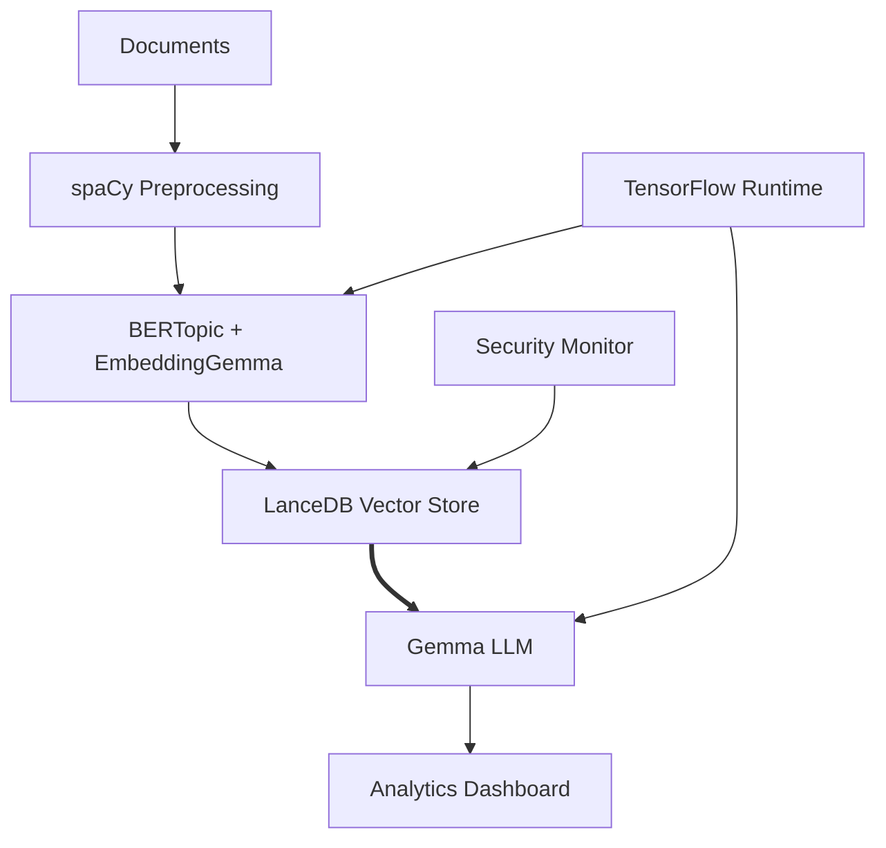

# Sovereign AI  RAG: Complete Implementation Guide

A comprehensive step-by-step guide for implementing an Enterprise  RAG (Retrieval-Augmented Generation) Analytics Dashboard built on the principle of "Sovereign AI" - maintaining complete control over data and AI-driven intelligence without external cloud dependencies.

## 🎯 Overview

This system processes internal  documents, embeds them for semantic understanding, stores them in a secure vector database, and generates accurate, context-aware responses through a user-friendly dashboard. All processing happens entirely on-premises, ensuring data sovereignty and maximum security.

### Core Architecture



### Component Overview

| Component | Function |  Use Case |
|-----------|----------|------------------|
| LanceDB | Unified data stack (cache + archive) | Scalable storage for millions of  documents |
| spaCy | Text preprocessing & NER | Extract entities (account numbers, SSNs, regulations) |
| BERTopic + EmbeddingGemma | Semantic embedding generation | Understand  terminology and context |
| Gemma | Local LLM for generation | Generate compliance reports and risk assessments |
| TensorFlow | ML runtime & on-device training | Continuous learning from new  documents |

## 📋 Prerequisites

- Python 3.9+
- 16GB+ RAM (recommended)
- 50GB+ free disk space
- Linux/macOS/Windows environment
- Docker (for containerized deployment)

---

## 🚀 Phase 1: Environment Setup and Project Structure

### Step 1: Prepare Your Sovereign Environment

Set up a local Python environment and install all required dependencies. This creates a self-contained system for all data processing and AI tasks, ensuring no data leaves your premises.

```bash
# Create virtual environment
python -m venv -rag-env
source -rag-env/bin/activate  # On Windows: -rag-env\Scripts\activate

# Install dependencies
pip install lancedb spacy bertopic tensorflow transformers streamlit pandas torch sentence-transformers

# Download spacy model
python -m spacy download en_core_web_lg
```

### Step 2: Organize the Directory Structure

Create a modular project structure that separates concerns like data ingestion, embedding, and retrieval.

```
-rag-dashboard/
├── src/
│   ├── data_ingestion/
│   ├── embeddings/
│   ├── retrieval/
│   ├── generation/
│   └── dashboard/
├── data/
│   ├── documents/        # Raw  documents
│   ├── embeddings/       # LanceDB vector store
│   └── models/           # Local model cache
├── config/
└── notebooks/
```

**Strategic Summary:** This foundational setup represents an architectural pivot away from hardware-dependent systems. The modular structure is essential for building a robust and evolvable system, with each directory mapping to a core function in the AI pipeline.

---

## 🔍 Phase 2: Data Processing and Ingestion

### Step 3: Implement Document Processing with spaCy

Create the `DocumentProcessor` that uses spaCy to ingest raw text, perform named entity recognition (NER), and segment text into semantically meaningful chunks.

Create `src/data_ingestion/document_processor.py`:

```python
import spacy
import lancedb
import pandas as pd
from pathlib import Path
from typing import List, Dict

class DocumentProcessor:
    def __init__(self, lance_db_path: str = "./data/embeddings"):
        self.nlp = spacy.load("en_core_web_lg")
        self.db = lancedb.connect(lance_db_path)
    
    def preprocess_document(self, text: str, doc_type: str) -> Dict:
        doc = self.nlp(text)
        entities = [{'text': ent.text, 'label': ent.label_} for ent in doc.ents]
        sentences = [sent.text.strip() for sent in doc.sents if len(sent.text.strip()) > 20]
        
        return {
            'chunks': sentences,
            'entities': entities,
            'doc_type': doc_type
        }
    
    def process_compliance_documents(self, file_path: Path) -> List[Dict]:
        with open(file_path, 'r', encoding='utf-8') as f:
            content = f.read()
        
        processed = self.preprocess_document(content, 'compliance')
        compliance_chunks = []
        
        for i, chunk in enumerate(processed['chunks']):
            compliance_chunks.append({
                'text': chunk,
                'source_file': str(file_path),
                'chunk_id': f"{file_path.stem}_{i}",
                'document_type': 'compliance',
                'security_level': 'confidential'
            })
        
        return compliance_chunks
```

**Strategic Summary:** This stage prepares raw text for intelligence extraction. By identifying and labeling specific  entities, you add a layer of contextual understanding from the start, making subsequent retrieval more accurate and relevant.

---

## 🧠 Phase 3: Embedding Generation and Vector Storage

### Step 4: Create  Context Embeddings

Implement the `Embedder` that converts preprocessed text into vector embeddings and stores them in LanceDB.

Create `src/embeddings/_embedder.py`:

```python
from sentence_transformers import SentenceTransformer
from bertopic import BERTopic
import numpy as np
import lancedb
import pandas as pd
from typing import List, Dict

class Embedder:
    def __init__(self, model_name: str = "sentence-transformers/all-MiniLM-L6-v2"):
        self.embedding_model = SentenceTransformer(model_name)
        self.topic_model = BERTopic(embedding_model=self.embedding_model)
    
    def generate_embeddings(self, documents: List[Dict]) -> None:
        texts = [doc['text'] for doc in documents]
        embeddings = self.embedding_model.encode(texts, show_progress_bar=True)
        topics, _ = self.topic_model.fit_transform(texts, embeddings)
        
        for i, doc in enumerate(documents):
            doc['topic_id'] = topics[i]
            doc['embedding'] = embeddings[i]
    
    def store_in_lancedb(self, documents: List[Dict], table_name: str = "_documents"):
        db = lancedb.connect("./data/embeddings")
        df_data = pd.DataFrame(documents)
        df_data['vector'] = df_data['embedding'].apply(lambda x: x.tolist())
        df_data.drop('embedding', axis=1, inplace=True)
        
        if table_name in db.table_names():
            table = db.open_table(table_name)
            table.add(df_data)
        else:
            db.create_table(table_name, data=df_data)
```

### Step 5: Implement Intelligent Retrieval System

Create the `RAGRetriever` for high-speed semantic searches on the LanceDB vector store.

Create `src/retrieval/lance_retriever.py`:

```python
import lancedb
from sentence_transformers import SentenceTransformer
from typing import List, Dict, Optional

class RAGRetriever:
    def __init__(self, db_path: str = "./data/embeddings"):
        self.db = lancedb.connect(db_path)
        self.embedding_model = SentenceTransformer("sentence-transformers/all-MiniLM-L6-v2")
    
    def semantic_search(self, 
                       query: str, 
                       table_name: str = "_documents", 
                       top_k: int = 5, 
                       security_filter: Optional[str] = None) -> List[Dict]:
        
        query_embedding = self.embedding_model.encode(query)
        table = self.db.open_table(table_name)
        search_builder = table.search(query_embedding).limit(top_k)
        
        if security_filter:
            search_builder = search_builder.where(f"security_level = '{security_filter}'")
        
        results = search_builder.to_df()
        return results.to_dict('records')
```

**Strategic Summary:** This step ensures semantic consistency between documents and user queries by using the same embedding model for both. LanceDB's disk-first architecture allows the system to query massive knowledge bases that exceed available RAM.

---

## 🤖 Phase 4: RAG System Implementation

### Step 6: Build the Streamlit Dashboard

Create the user-facing dashboard that integrates the entire system, connecting user queries with retrieved context and AI-generated responses.

Create `src/generation/gemma_generator.py`:

```python
# Placeholder for GemmaGenerator - replace with actual Gemma implementation
class GemmaGenerator:
    def __init__(self, model_name: str = "google/gemma-2b-it"):
        self.model_name = model_name
        # Initialize your Gemma model here
        
    def generate_response(self, query: str, context: str) -> str:
        # Implement actual Gemma generation logic
        prompt = f"""
        Context: {context}
        
        Question: {query}
        
        Based on the provided context, please provide a detailed and accurate answer to the question.
        """
        
        # Replace with actual model inference
        return f"Based on the context provided, the answer to '{query}' is generated using the  documents context."
```

Create `src/dashboard/streamlit_app.py`:

```python
import streamlit as st
from src.retrieval.lance_retriever import RAGRetriever
from src.generation.gemma_generator import GemmaGenerator

@st.cache_resource
def initialize_system():
    retriever = RAGRetriever()
    generator = GemmaGenerator()
    return retriever, generator

st.set_page_config(page_title=" RAG Dashboard", layout="wide")
st.title("🏦 Enterprise  RAG Analytics Dashboard")

retriever, generator = initialize_system()

# Sidebar for configuration
with st.sidebar:
    st.header("Configuration")
    top_k = st.slider("Number of documents to retrieve", 1, 10, 3)
    security_filter = st.selectbox("Security Level", ["All", "confidential", "internal", "public"])

# Main interface
query = st.text_area("Enter your query about  documents:", height=100)

if st.button("Generate Answer", type="primary"):
    if query:
        with st.spinner("Searching for relevant documents..."):
            security_filter_value = None if security_filter == "All" else security_filter
            results = retriever.semantic_search(query, top_k=top_k, security_filter=security_filter_value)
            context = "\n\n".join([r['text'] for r in results])
        
        with st.spinner("Generating AI-powered answer..."):
            response = generator.generate_response(query, context)
        
        # Display results
        col1, col2 = st.columns([2, 1])
        
        with col1:
            st.subheader("🤖 Generated Answer")
            st.write(response)
        
        with col2:
            st.subheader("📊 Query Metrics")
            st.metric("Documents Retrieved", len(results))
            st.metric("Context Length", len(context))
        
        # Sources section
        st.subheader("📚 Sources")
        for i, result in enumerate(results):
            with st.expander(f"Source {i+1}: {result.get('source_file', 'Unknown')}", expanded=False):
                st.write("**Content:**")
                st.write(result['text'])
                st.write("**Document Type:**", result.get('document_type', 'Unknown'))
                st.write("**Security Level:**", result.get('security_level', 'Unknown'))
    else:
        st.warning("Please enter a query to proceed.")

# Footer
st.markdown("---")
st.markdown("*Sovereign AI  RAG - Secure, Private, On-Premises Intelligence*")
```

**Strategic Summary:** The entire pipeline is designed to be fully local, fast, and private. Gemma generates responses that are "grounded" in the retrieved documents, ensuring answers are based on the enterprise's own data, fulfilling the core vision of Sovereign AI.

---

## 🔐 Phase 5: Deployment and Security Configuration

### Step 7: Configure, Containerize, and Secure

#### Configuration Management

Create `config/_config.yaml`:

```yaml
#  RAG Configuration
database:
  lance_db_path: "./data/embeddings"
  table_name: "_documents"

models:
  embedding_model: "sentence-transformers/all-MiniLM-L6-v2"
  generation_model: "google/gemma-2b-it"

security:
  encryption_enabled: true
  audit_logging: true

compliance:
  data_retention_days: 2555  # 7 years for 
  gdpr_compliant: true

performance:
  max_concurrent_queries: 10
  cache_enabled: true
  
logging:
  level: "INFO"
  file_path: "./logs/_rag.log"
```

#### Container Deployment

Create `requirements.txt`:

```
lancedb>=0.3.0
spacy>=3.7.0
bertopic>=0.15.0
tensorflow>=2.13.0
transformers>=4.30.0
streamlit>=1.25.0
pandas>=2.0.0
torch>=2.0.0
sentence-transformers>=2.2.0
PyYAML>=6.0
cryptography>=41.0.0
```

Create `Dockerfile`:

```dockerfile
FROM python:3.9-slim

# Set working directory
WORKDIR /app

# Install system dependencies
RUN apt-get update && apt-get install -y \
    build-essential \
    curl \
    software-properties-common \
    && rm -rf /var/lib/apt/lists/*

# Copy requirements and install Python dependencies
COPY requirements.txt .
RUN pip install --no-cache-dir -r requirements.txt

# Download spaCy model
RUN python -m spacy download en_core_web_lg

# Copy application code
COPY src/ /app/src/
COPY config/ /app/config/

# Create necessary directories
RUN mkdir -p /app/data/documents /app/data/embeddings /app/data/models /app/logs

# Expose Streamlit port
EXPOSE 8501

# Health check
HEALTHCHECK CMD curl --fail http://localhost:8501/_stcore/health

# Run the application
CMD ["streamlit", "run", "src/dashboard/streamlit_app.py", "--server.port=8501", "--server.address=0.0.0.0"]
```

Create `docker-compose.yml`:

```yaml
version: '3.8'

services:
  -rag:
    build: .
    ports:
      - "8501:8501"
    volumes:
      - ./data:/app/data
      - ./logs:/app/logs
      - ./config:/app/config
    environment:
      - PYTHONPATH=/app
    restart: unless-stopped
    security_opt:
      - no-new-privileges:true
    read_only: true
    tmpfs:
      - /tmp
```

#### Security Hardening

Create `security_setup.sh`:

```bash
#!/bin/bash

# Enable firewall
sudo ufw enable
sudo ufw allow 8501  # Streamlit port

# Set up SSL/TLS (replace with your domain)
# sudo certbot --nginx -d -rag.yourbank.com

# Set proper file permissions
chmod 600 config/_config.yaml
chmod -R 750 src/
chmod -R 700 data/

# Create restricted user for running the service
sudo useradd -r -s /bin/false -rag
sudo chown -R -rag:-rag /app

echo "Security hardening completed!"
```

#### Production Deployment Script

Create `deploy.sh`:

```bash
#!/bin/bash

echo "🚀 Deploying Sovereign AI  RAG System..."

# Build and start the containers
docker-compose up --build -d

# Wait for service to be ready
echo "⏳ Waiting for service to start..."
sleep 30

# Check if service is running
if curl -f http://localhost:8501/_stcore/health; then
    echo "✅  RAG Dashboard is running at http://localhost:8501"
else
    echo "❌ Deployment failed. Check logs with: docker-compose logs"
    exit 1
fi

echo "🎉 Deployment completed successfully!"
```

**Strategic Summary:** This final phase operationalizes the Sovereign AI system. Configuration management allows fine-tuning of security and performance parameters. Container deployment ensures consistency across environments, and security hardening is paramount in  contexts.

---

## 🎯 Getting Started

1. **Clone and Setup:**
   ```bash
   git clone <your-repo>
   cd -rag-dashboard
   chmod +x deploy.sh security_setup.sh
   ```

2. **Quick Start:**
   ```bash
   ./deploy.sh
   ```

3. **Access Dashboard:**
   Open http://localhost:8501 in your browser

4. **Add Documents:**
   - Place  documents in `data/documents/`
   - Run the ingestion pipeline to process and embed documents

## 📖 Usage Examples

### Processing Documents
```python
from src.data_ingestion.document_processor import DocumentProcessor
from src.embeddings._embedder import Embedder

# Process documents
processor = DocumentProcessor()
embedder = Embedder()

# Load and process compliance documents
chunks = processor.process_compliance_documents(Path("data/documents/compliance.txt"))

# Generate embeddings and store
embedder.generate_embeddings(chunks)
embedder.store_in_lancedb(chunks)
```

### Querying the System
```python
from src.retrieval.lance_retriever import RAGRetriever

retriever = RAGRetriever()
results = retriever.semantic_search("What are the KYC requirements for new accounts?")
```

## 🛡️ Security Features

- **Data Sovereignty:** All processing happens on-premises
- **Encryption:** Data at rest and in transit encryption
- **Access Control:** Role-based access with security level filtering
- **Audit Logging:** Comprehensive activity tracking
- **Compliance:** GDPR compliant with configurable retention policies

## 📊 Performance Optimization

- **Vector Database:** LanceDB for efficient similarity search
- **Caching:** Smart caching for frequently accessed data
- **Batch Processing:** Optimized document processing pipelines
- **Resource Management:** Configurable concurrency limits

## 🔧 Troubleshooting

### Common Issues:
1. **Memory Issues:** Increase system RAM or reduce batch sizes
2. **Model Loading:** Ensure sufficient disk space for model downloads
3. **Permission Errors:** Check file permissions and user access rights
4. **Port Conflicts:** Modify port configuration in docker-compose.yml

### Monitoring:
- Check logs: `docker-compose logs -f`
- Monitor resources: `docker stats`
- Health checks: `curl http://localhost:8501/_stcore/health`

---

## 📄 License

This project is designed for enterprise  environments with appropriate security and compliance considerations. Ensure all usage complies with your organization's data governance policies.

**Built with Sovereign AI principles - Your data, your intelligence, your control.**
