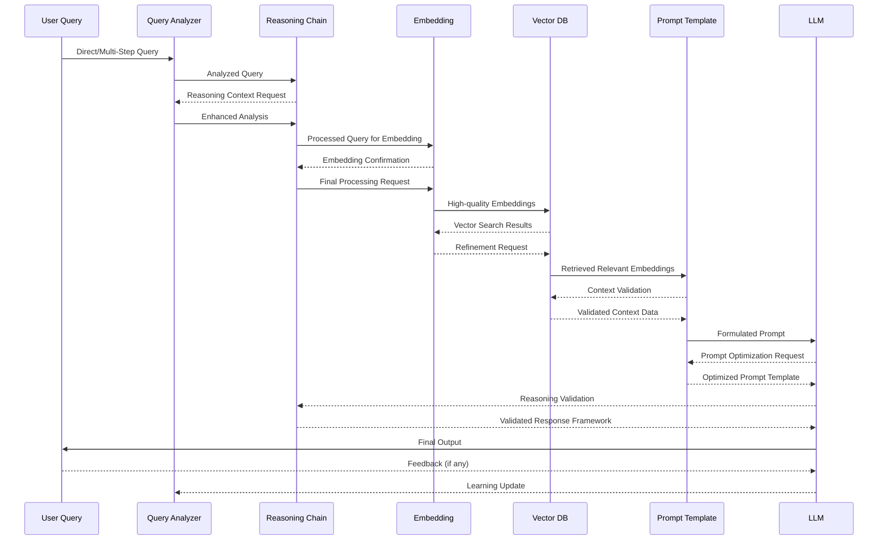

The system consists of four main components that work together:

1. **Text Cleaning Utility**: Normalizes and preprocesses raw text
2. **Text Structuring Tool**: Extracts entities and relationships with context
3. **Text Embedding Service**: Vectorizes structured data and stores it in Milvus
4. **Search Application**: Enables natural language queries against the vector database

## How the Components Work Together

### Data Processing Pipeline

```
Raw Text → Clean Text → Structured Data → Vector Embeddings → Search Interface
```

1. **Raw Text Intake**: The system begins with raw, unstructured text data (books, articles, documents)
2. **Text Cleaning**: The first component removes noise and normalizes the text
3. **Information Extraction**: The second component identifies entities and relationships
4. **Vector Embedding**: The third component converts structured data to vector representations
5. **Indexed Storage**: Vectors are stored in Milvus with their metadata and relationships
6. **Search Interface**: The final component enables semantic search via text queries


## Component 1: Text Cleaning Utility

The Text Cleaning Utility prepares raw text for further processing by:

- Removing HTML/XML tags and irrelevant characters
- Normalizing text (lowercase conversion)
- Handling punctuation intelligently
- Removing stopwords and applying stemming/lemmatization
- Performing basic tokenization

**Input**: Raw text files (books, articles, documents)  
**Output**: Cleaned text files with prefix `clean_`

## Component 2: Text Structuring and Relationship Extraction

The Text Structuring component performs advanced NLP to extract meaningful information:

- Named Entity Recognition (NER) to identify people, organizations, locations, etc.
- Relationship extraction through dependency parsing
- Event detection to identify important occurrences
- Context preservation to maintain semantic understanding
- Knowledge graph construction to represent connections

**Input**: Cleaned text files with prefix `clean_`  
**Output**: Structured JSON files with prefix `struct_` containing entities, relationships, and context

## Component 3: Text Embedding with GloVe and Milvus

The Text Embedding component vectorizes the structured data:

- Generates GloVe embeddings for entities, statements, and relationships
- Creates specialized collections in Milvus for different data types
- Stores vectors with their metadata for retrieval
- Configures indices for efficient similarity search
- Preserves relationship information in the vector database

**Input**: Structured JSON files with prefix `struct_`  
**Output**: Populated Milvus vector database with entities, statements, and relationships

## Component 4: Vector Search Application

The Search Application provides the interface for querying the system:

- Converts natural language queries to vector embeddings
- Searches for similar entities, statements, and relationships
- Retrieves and ranks results by semantic similarity
- Presents information with context and source attribution
- Supports both web interface and API access

**Input**: User queries in natural language  
**Output**: Semantically relevant results from the document corpus

## Complete System Integration

### Data Flow Examples

#### Example 1: Book Processing

```
1. Raw Book → Text Cleaning Utility
   Input: "The Adventures of Sherlock Holmes.txt"
   Output: "clean_The Adventures of Sherlock Holmes.txt"

2. Cleaned Text → Text Structuring Tool
   Input: "clean_The Adventures of Sherlock Holmes.txt"
   Output: "struct_The Adventures of Sherlock Holmes.txt.json"

3. Structured Data → Text Embedding Service
   Input: "struct_The Adventures of Sherlock Holmes.txt.json"
   Output: Populated Milvus collections (entities, statements, relationships)

4. Vector Database → Search Application
   User query: "Who was Sherlock Holmes' nemesis?"
   Results: References to Professor Moriarty with contextual information
```

#### Example 2: Multi-Document Analysis

```
1. Process multiple documents through the pipeline
2. Build a comprehensive knowledge base in the vector database
3. Query across documents: "What companies were founded in California?"
4. Retrieve relevant information from multiple sources with attribution
```
