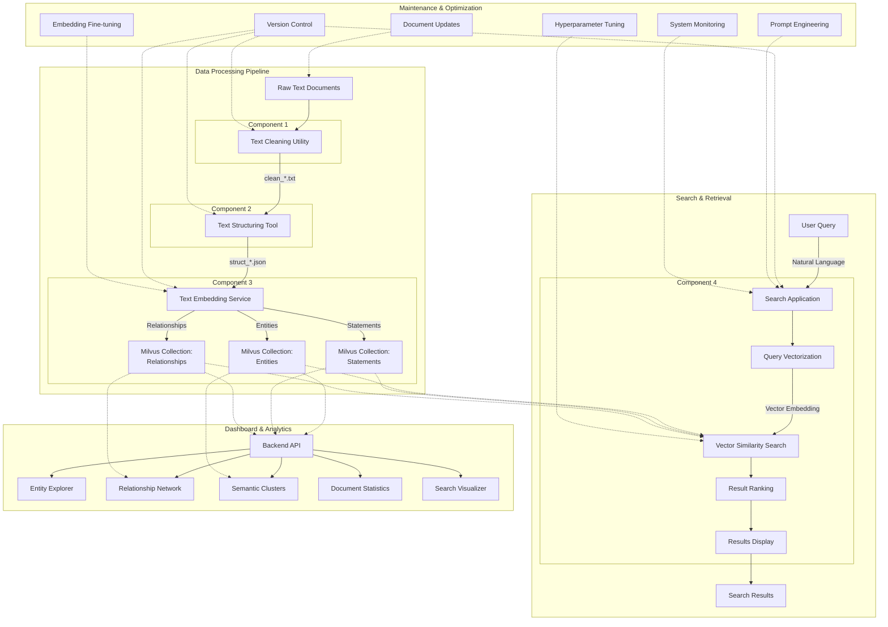

# Complete NLP Vector Search RAG System

This repository contains a comprehensive Retrieval-Augmented Generation (RAG) system built on natural language processing, vector embeddings, and semantic search capabilities. The system processes unstructured text data, structures it with relationship information, and enables efficient semantic search through vector embeddings.

## System Architecture



The system consists of four main components that work together:

1. **Text Cleaning Utility**: Normalizes and preprocesses raw text
2. **Text Structuring Tool**: Extracts entities and relationships with context
3. **Text Embedding Service**: Vectorizes structured data and stores it in Milvus
4. **Search Application**: Enables natural language queries against the vector database

## How the Components Work Together

### Data Processing Pipeline

```
Raw Text → Clean Text → Structured Data → Vector Embeddings → Search Interface
```

1. **Raw Text Intake**: The system begins with raw, unstructured text data (books, articles, documents)
2. **Text Cleaning**: The first component removes noise and normalizes the text
3. **Information Extraction**: The second component identifies entities and relationships
4. **Vector Embedding**: The third component converts structured data to vector representations
5. **Indexed Storage**: Vectors are stored in Milvus with their metadata and relationships
6. **Search Interface**: The final component enables semantic search via text queries

## Component 1: Text Cleaning Utility

The Text Cleaning Utility prepares raw text for further processing by:

- Removing HTML/XML tags and irrelevant characters
- Normalizing text (lowercase conversion)
- Handling punctuation intelligently
- Removing stopwords and applying stemming/lemmatization
- Performing basic tokenization

**Input**: Raw text files (books, articles, documents)  
**Output**: Cleaned text files with prefix `clean_`

## Component 2: Text Structuring and Relationship Extraction

The Text Structuring component performs advanced NLP to extract meaningful information:

- Named Entity Recognition (NER) to identify people, organizations, locations, etc.
- Relationship extraction through dependency parsing
- Event detection to identify important occurrences
- Context preservation to maintain semantic understanding
- Knowledge graph construction to represent connections

**Input**: Cleaned text files with prefix `clean_`  
**Output**: Structured JSON files with prefix `struct_` containing entities, relationships, and context

## Component 3: Text Embedding with GloVe and Milvus

The Text Embedding component vectorizes the structured data:

- Generates GloVe embeddings for entities, statements, and relationships
- Creates specialized collections in Milvus for different data types
- Stores vectors with their metadata for retrieval
- Configures indices for efficient similarity search
- Preserves relationship information in the vector database

**Input**: Structured JSON files with prefix `struct_`  
**Output**: Populated Milvus vector database with entities, statements, and relationships

## Component 4: Vector Search Application

The Search Application provides the interface for querying the system:

- Converts natural language queries to vector embeddings
- Searches for similar entities, statements, and relationships
- Retrieves and ranks results by semantic similarity
- Presents information with context and source attribution
- Supports both web interface and API access

**Input**: User queries in natural language  
**Output**: Semantically relevant results from the document corpus

## Complete System Integration

### Data Flow Examples

#### Example 1: Book Processing

```
1. Raw Book → Text Cleaning Utility
   Input: "The Adventures of Sherlock Holmes.txt"
   Output: "clean_The Adventures of Sherlock Holmes.txt"

2. Cleaned Text → Text Structuring Tool
   Input: "clean_The Adventures of Sherlock Holmes.txt"
   Output: "struct_The Adventures of Sherlock Holmes.txt.json"

3. Structured Data → Text Embedding Service
   Input: "struct_The Adventures of Sherlock Holmes.txt.json"
   Output: Populated Milvus collections (entities, statements, relationships)

4. Vector Database → Search Application
   User query: "Who was Sherlock Holmes' nemesis?"
   Results: References to Professor Moriarty with contextual information
```

#### Example 2: Multi-Document Analysis

```
1. Process multiple documents through the pipeline
2. Build a comprehensive knowledge base in the vector database
3. Query across documents: "What companies were founded in California?"
4. Retrieve relevant information from multiple sources with attribution
```

## Installation and Setup

### Prerequisites

- Python 3.8+
- Docker (for Milvus)
- 8GB+ RAM

### Setting Up the Complete System

1. **Clone the repository**:
   ```bash
   git clone https://github.com/yourusername/nlp-vector-rag-system.git
   cd nlp-vector-rag-system
   ```

2. **Create a virtual environment**:
   ```bash
   python -m venv venv
   source venv/bin/activate  # On Windows: venv\Scripts\activate
   ```

3. **Install dependencies**:
   ```bash
   pip install -r requirements.txt
   ```

4. **Download required models**:
   ```bash
   python -m spacy download en_core_web_sm
   ```

5. **Start Milvus**:
   ```bash
   docker run -d --name milvus_standalone \
       -p 19530:19530 \
       -p 19121:19121 \
       milvusdb/milvus:latest
   ```

## Usage

### Processing a Single Document

```bash
# 1. Clean the text
python text_cleaner.py my_book.txt --output cleaned

# 2. Extract structured information
python text_structurer.py cleaned/clean_my_book.txt --output structured

# 3. Generate embeddings and store in Milvus
python text_embedder.py structured/struct_my_book.txt.json

# 4. Start the search application
python app.py
```

Visit http://localhost:5000 to access the search interface.

### Processing a Directory of Documents

```bash
# 1. Clean all text files in a directory
python text_cleaner.py my_documents/ --output cleaned

# 2. Extract structured information from all cleaned files
python text_structurer.py cleaned/ --output structured

# 3. Generate embeddings for all structured files
python text_embedder.py structured/

# 4. Start the search application
python app.py
```

### Using the Command-Line Interface

For quick searches without the web interface:

```bash
python cli_search.py "Who founded Apple?" --limit 5
```

## How RAG Works in This System

This system implements Retrieval-Augmented Generation (RAG) principles by:

1. **Indexing Phase**:
   - Processing and structuring text data 
   - Converting to vector embeddings
   - Storing in a vector database with metadata

2. **Retrieval Phase**:
   - Converting user queries to vector embeddings
   - Finding semantically similar content
   - Retrieving relevant context and relationships

3. **Response Generation**:
   - Presenting structured information with context
   - Providing source attribution
   - Supporting natural language interaction

The key advantage of this RAG approach is that it enables semantic understanding beyond keyword matching. By using vector embeddings, the system can find information that is conceptually related to the query, even if it doesn't share the exact same words.

## Customization and Extension

### Using Different Embedding Models

You can modify the Text Embedder to use different embedding models:

```python
# Using Sentence Transformers instead of GloVe
from sentence_transformers import SentenceTransformer

# In TextEmbedder.__init__:
self.model = SentenceTransformer('all-MiniLM-L6-v2')

# In get_embedding:
def get_embedding(self, text):
    return self.model.encode(text)
```

### Adding Domain-Specific Processing

For specialized domains like medical or legal texts:

1. Extend the Text Cleaner with domain-specific preprocessing
2. Add custom entity types to the Text Structurer
3. Implement domain-specific relationship patterns
4. Use domain-adapted embedding models

### Integrating with Large Language Models

To extend this system with generative capabilities:

1. Install additional requirements:
   ```bash
   pip install transformers torch
   ```

2. Add an LLM service to the search application:
   ```python
   from transformers import AutoModelForCausalLM, AutoTokenizer

   def generate_response(query, context):
       prompt = f"Based on the following information:\n{context}\n\nAnswer this question: {query}"
       # Generate response using an LLM
       # ...
       return response
   ```

3. Modify the search route to include generated responses:
   ```python
   @app.route('/search', methods=['POST'])
   def search():
       # ... existing search code ...
       
       # Get top results
       top_results = results["statements"][:3]
       context = "\n".join([r["statement"] for r in top_results])
       
       # Generate a response
       generated_response = generate_response(query_text, context)
       
       return render_template('results.html', 
                             query=query_text,
                             generated_response=generated_response,
                             entities=results["entities"],
                             statements=results["statements"],
                             relationships=results["relationships"])
   ```

## Performance Optimization

### Vector Database Optimization

- Use the appropriate index type in Milvus:
  ```python
  # For smaller datasets (faster build, slower search)
  index_params = {"index_type": "FLAT"}
  
  # For medium datasets
  index_params = {"index_type": "IVF_FLAT", "params": {"nlist": 1024}}
  
  # For large datasets
  index_params = {"index_type": "HNSW", "params": {"M": 16, "efConstruction": 500}}
  ```

### Processing Large Document Collections

- Process files in batches to manage memory usage
- Use multiprocessing for parallel document processing
- Consider incremental updates to the vector database

## Technical Deep Dive

### Entity Relationship Model

The system's entity relationship model consists of:

- **Entities**: Named objects (people, organizations, locations, etc.)
- **Relationships**: Connections between entities (works for, located in, founded, etc.)
- **Statements**: Natural language assertions about entities and relationships
- **Context**: Surrounding text that provides meaning and attribution

### Vector Search Mechanics

When a user submits a query:

1. The query is converted to a vector using the same embedding model
2. Milvus performs Approximate Nearest Neighbor (ANN) search
3. The most similar vectors are retrieved based on distance metrics
4. Results are ranked by similarity score
5. Associated metadata is returned with the results

### Knowledge Graph Representation

The system maintains an implicit knowledge graph:

- **Nodes**: Entities with their properties
- **Edges**: Relationships between entities
- **Attributes**: Metadata like source documents and context

## Conclusion

This NLP Vector Search RAG system provides a complete pipeline for:

1. Processing unstructured text data
2. Extracting structured information and relationships
3. Creating semantic vector representations
4. Enabling natural language search with contextual results

By combining NLP techniques, vector embeddings, and semantic search, the system delivers intelligent information retrieval that understands the meaning behind queries rather than just matching keywords.

## References and Further Reading

- [GloVe: Global Vectors for Word Representation](https://nlp.stanford.edu/projects/glove/)
- [Milvus Vector Database](https://milvus.io/docs)
- [spaCy NLP Library](https://spacy.io/usage/linguistic-features)
- [Retrieval-Augmented Generation for Knowledge-Intensive NLP Tasks](https://arxiv.org/abs/2005.11401)
- [Vector Search: From Embeddings to Applications](https://www.pinecone.io/learn/vector-search/)
